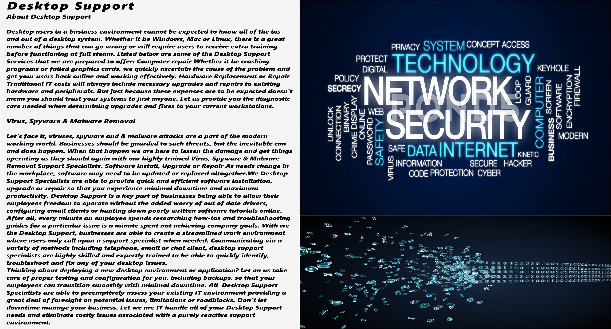
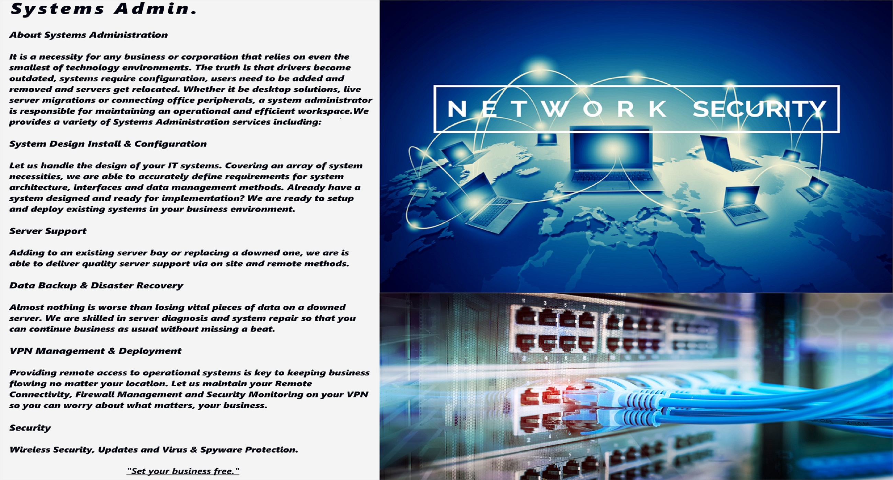
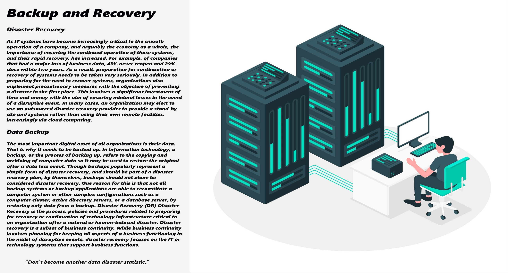

# Hello,

---

My name is David and I’m a Network Administrator · Security . I have a passion for Network Security, Vulnerability and Technology in general. I dedicate myself to home automation hobby projects, I work as a Freelance and I am an active member in many communities such as: GitHub, Reddit, Wiki, Infosec, The Hacker News, Cisco, Fortinet, Rapid7, various linux communities etc.. I also love the open source code.

I was born in Rome. So, I’m Italian and like all Italian people, I love pasta and pizza. And…of course, I always say “Mamma Mia!”

I graduated @ ITIS Vallauri School where I discovered my passion for Computer science, information science declined to Network Security and Penetration Testing and the whole IT world. I am currently studying at the Cisco Networking Academy where I am expanding my computer skills, I follow various information courses on Udemy, books etc.. and sometimes I dabble in sites like Hack The Box.

And please, don't forget ... Networking is a set of tactics and best practices for dealing with user growth.

## IT Solution

---

The world of IT is complex. Smarter IT makes it simple.

Welcome

Our consultants at IT bring you smarter solutions that streamline technology so you can focus on your business. Our goal is to create strategic solutions to further your business growth.

We help organizations improve their performance, operating primarily through the analysis of existing organizational problems and the development of plans for improvement. We have spent years learning best practices and growing through the complicated IT situations we have encountered.

We want to offer strategy led IT management solutions that allow you to grow as a company while working smarter. We will make recommendations for more effective or efficient ways of performing work tasks when we see them. We will also point out the things that are effective and productive. We want to help your business grow.

Challenge

The world of IT is complex. Smarter IT makes it simple.

Imagination is..

"Imagination is more important than knowledge. For knowledge is limited, whereas imagination embraces the entire world, stimulating progress, giving birth to evolution."

> — Albert Einstei

When something is important enough, you do it even if the odds are not in your favor.
